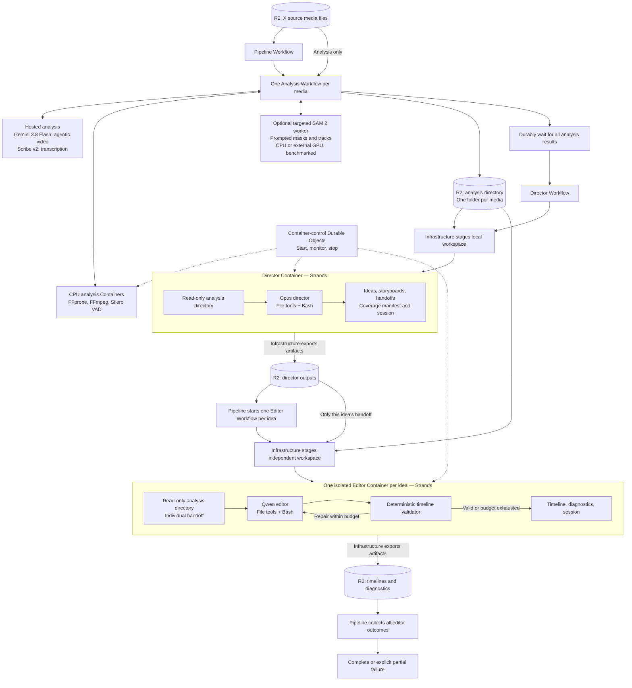

# Asynchronous media-to-timeline pipeline

## Scope and decisions

**X media files → analyze each file → one director agent → one editor agent per idea → validated timelines.** The cost-estimate baseline is 100 five-minute assets and ten ideas/editors.

- Cloudflare Workflows owns durable orchestration, fan-out, waits, retries, and completion collection.
- Strands harness runs each director/editor in an isolated Cloudflare Container with a real local filesystem and Bash. Hosted providers perform model inference.
- Agents use only file read/write tools and Bash. They have no R2 tools, credentials, or source-media access. Infrastructure stages files and exports artifacts.
- R2 is the durable store for original media, analysis, handoffs, sessions, and results. Container disks are disposable workspaces, not recovery storage.
- Durable Objects control container lifecycle; no separate agent-session Durable Objects are required in this design.
- UI, public API, analysis deduplication/cache design, rendering, and rendered-preview QA are out of scope. The output is timeline JSON, not a rendered video.

See [media-analysis-architecture.md](media-analysis-architecture.md) for the three analysis sub-pipelines: Gemini 3.8 Flash agentic video understanding, VAD + Scribe transcription, and optional targeted SAM 2 segmentation. [pipeline-cost-estimate.md](pipeline-cost-estimate.md) contains planning comparisons; its static-video estimates require rebenchmarking for agentic processing and conditional segmentation.

## Architecture



Arrows between workflows and containers represent asynchronous job submission and durable completion tracking, not a single long-lived HTTP request. Artifact publication is part of completion: an agent is not finished until its results are durably saved.

## Execution

1. **Analyze each input independently.** After FFprobe/FFmpeg inspection/preparation, run three applicable sub-pipelines: **Gemini 3.8 Flash agentic video understanding** for summary, tags, and semantic scene breakdown; **Silero VAD + Scribe v2** for transcription/timing/diarization; and **optional SAM 2** for specifically requested frames/scenes with spatial target prompts. Understanding and transcription run in parallel; scene-referenced SAM requests wait for scene IDs. Semantic scene times are approximate, not exact shot boundaries. Skip irrelevant stages for images, audio-only, or silent assets; use normal Gemini image analysis for stills. See the [per-media analysis design](media-analysis-architecture.md) for contracts. Workers persist results and stop independently rather than remain awake solely for hosted-provider waits.
2. **Publish analysis.** Infrastructure writes each media folder plus a complete index to R2. Freeze this analysis manifest for the run. A terminal analysis failure blocks the director by default and is reported explicitly; do not silently omit an asset.
3. **Stage the director workspace.** Copy the extracted-data library to a local read-only directory. Do not stage original video, audio, or image files. Immutable manifests or analysis bundles can reduce transfer requests while preserving the directory layout after extraction.
4. **Run the director.** A fresh Strands session explores files incrementally, tracks coverage of every asset, and produces distinct ideas/storyboards and a self-contained handoff per idea. Missing source evidence is reported, not invented.
5. **Publish handoffs and fan out.** After validating and saving director outputs, start one independent editor workflow/container per idea, with bounded concurrency. The baseline runs all ten editors, with no approval gate.
6. **Run editors.** Each receives the analysis directory, its own handoff, and the deterministic validator. It writes a timeline, validates source references/bounds, timing, tracks, and schema, and repairs within its turn/spend limit. It does not inherit other editor sessions or the director's full history.
7. **Publish and stop.** Infrastructure exports results, diagnostics, and recoverable session artifacts before stopping each container. The pipeline collects successful and failed outcomes without rerunning successful siblings.

## Agent-visible filesystem

```text
/workspace/
├── analysis/                    # Read-only; all extracted media records
│   ├── index.json               # Media IDs, paths, record availability
│   ├── media-001/
│   │   ├── metadata.json
│   │   ├── summary.md
│   │   ├── manifest.json
│   │   ├── tags.json
│   │   ├── scenes.json          # Semantic intervals, not frame-accurate shots
│   │   ├── transcript.json
│   │   ├── speech.json
│   │   └── tracks.json          # Optional targeted SAM 2 results
│   └── media-002/
├── input/                       # Read-only request or individual handoff
├── output/                      # Writable deliverables and diagnostics
├── scratch/                     # Disposable working files
└── .agent/                      # Session state and offloaded context
```

An absent modality is identified explicitly in the index/metadata. Records preserve media IDs and timestamps so editors can reference original sources without opening them. Files on disk are not automatically included in model context; only requested file contents/tool outputs are sent. Page and truncate reads/tool output to keep context bounded.

## Strands configuration and isolation

- Use Anthropic for the director and a configured provider adapter for the selected Qwen endpoint. Verify model IDs, endpoint compatibility, tool calling, reasoning, and usage fields during implementation.
- Enable file read/write tools and Bash only. Disable web tools, helper-agent spawning, cross-run long-term memory, and other default capabilities. Workflows, not automatic subagents, performs the editor fan-out.
- Retain context management; persist both session state and any offloaded files needed for recovery. Use distinct run/session identities for the director and each editor.
- Run agent/tool processes as a restricted user. Enforce read-only inputs and per-run writable output/scratch directories with filesystem permissions and process isolation, not prompts.
- Stage/export through an infrastructure-controlled channel. Never expose R2 account credentials, signed storage URLs, or transfer-control credentials to agent prompts, environment, files, or Bash. A design that hides credentials in an accessible sibling process is insufficient.
- Bash is broad execution access. Restrict outbound networking and access to internal control endpoints; allow required model traffic through a controlled transport. Prevent shell access to runtime/provider secrets. Treat extracted text as untrusted data, not executable instructions.

The storage-transfer boundary, restricted shell, and model transport are implementation requirements to validate, not claims that the default Strands sandbox or Cloudflare Container configuration enforces them automatically.

## Async execution, durability, and billing

- Workflows waits consume no active CPU. Use completion events where practical or bounded status polling separated by durable sleeps; do not busy-poll.
- The initial design keeps an agent container awake throughout its run, including model waits. Async execution does **not** eliminate provisioned container memory/disk charges during those waits. Active CPU is charged separately.
- Keep containers alive while a job is legitimately running, enforce an overall deadline, and stop promptly after artifact export or terminal failure. Do not assume an idle-sleep configuration is safe for a background agent job.
- Persist compact job IDs, attempt IDs, status, and artifact references in Workflow checkpoints. Store large payloads in R2.
- Give submitted jobs stable identities and inspect existing job status before resubmitting after a Workflow retry. Durable orchestration does not make external model calls exactly-once or free to replay.
- Infrastructure periodically exports consistent Strands session snapshots plus offloaded context. Resume from the last committed snapshot after failure; unsaved work may repeat and must be metered. Test interruption during model calls, tool execution, and artifact publication.
- Pausing containers between model calls is a possible later optimization, not a baseline assumption: it requires explicit turn-level state transfer and resume semantics.

## Validation before production

Benchmark director/editor startup, filesystem staging, CPU, awake duration, peak memory, disk, artifact-transfer volume, R2 operations, and provider usage. Test one complete run and forced recovery before scaling to ten editors. Confirm that analysis-only permissions hold even through Bash and that no raw media enters agent contexts.

## References

- [Cloudflare Workflows](https://www.cloudflare.com/products/workflows/)
- [Cloudflare Containers](https://developers.cloudflare.com/containers/)
- [Strands harness](https://strandsagents.com/docs/user-guide/harness/)
- [Strands file tools](https://strandsagents.com/docs/user-guide/harness/tools/shell-and-files/)
- [Strands sessions](https://strandsagents.com/docs/user-guide/harness/configure/sessions/)
- [Strands model configuration](https://strandsagents.com/docs/user-guide/harness/configure/model/)
