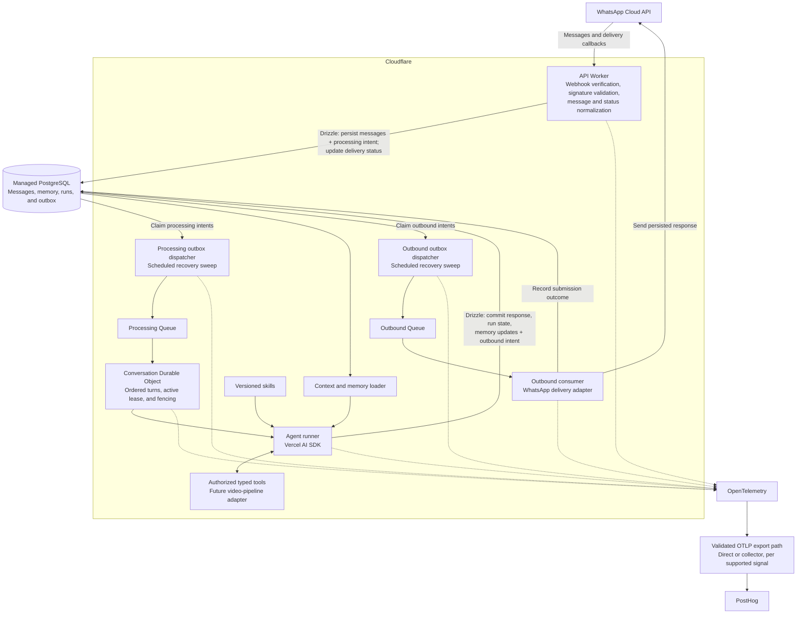

# WhatsApp AI agent: architecture and specifications

## 1. Scope

Build the basic roundtrip: receive a WhatsApp message, run an AI agent with context and memory, and send a response through WhatsApp.

The video-editing pipeline is out of scope. It will be integrated later as a tool; this document does not design its execution, storage, or orchestration.

### Included

- WhatsApp webhook verification, message ingestion, and delivery callbacks.
- Asynchronous agent processing and outbound delivery.
- Conversation coordination, context, memory, skills, and typed tools.
- Persistent application data and user identity associations.
- OpenTelemetry instrumentation and PostHog integration.
- Recovery, authorization, resource limits, and acceptance criteria.

### Excluded

- Video analysis, editing, rendering, and production workflows.
- Media ingestion/transcription pipelines and a web dashboard.
- Multi-agent orchestration and vector search.
- Hyperdrive at initial launch.

Initial functional baseline: one-to-one text conversations. Unsupported message types must be handled explicitly rather than interpreted as empty text. Broader modality support is a separate decision.

## 2. Technology decisions

| Concern | Selection |
| --- | --- |
| Hosting and HTTP | Cloudflare Workers, TypeScript, Node.js compatibility where needed |
| Conversation coordination | Cloudflare Durable Objects |
| Asynchronous work | Cloudflare Queues |
| Database | Managed PostgreSQL |
| ORM and migrations | Drizzle |
| Authentication | Better Auth |
| Agent model/tool loop | Vercel AI SDK |
| Telemetry | OpenTelemetry with PostHog integration |
| Messaging provider | WhatsApp Cloud API |

Workers are not full Node.js server processes. Use native request handlers without a server framework. If a full Node.js process becomes necessary, revisit deployment and use Fastify if a framework is needed; do not assume arbitrary Node.js packages work in Workers.

The PostgreSQL provider is not yet selected. Use its Workers-compatible driver or pooled endpoint. Verify that the chosen driver supports the required transaction behavior and Better Auth/Drizzle integration. Do not open a fresh unpooled database connection for every request.

Hyperdrive is intentionally excluded. Keep database access behind shared application modules so the connection transport can change later without changing domain logic.

## 3. Logical architecture



These are logical responsibilities, not a requirement for a separate deployment per box. Initially, deploy a small set of Workers with queue consumers, scheduled handlers, and a Durable Object binding.

PostgreSQL is the canonical source of messages, users, memory, runs, and delivery intent. Durable Object storage holds coordination state, not a competing copy of canonical conversation history. No atomic transaction spans PostgreSQL and Durable Object storage; recovery must reconcile from PostgreSQL.

## 4. Message lifecycle

### 4.1 Receive and acknowledge

1. Support the WhatsApp webhook verification challenge.
2. Validate incoming POST signatures against the raw request body before processing.
3. Distinguish incoming messages from delivery-status events. One webhook may contain multiple events.
4. Resolve the business channel and sender to a conversation and internal user identity.
5. In a PostgreSQL transaction, insert the incoming message and processing-outbox intent. Assign a per-conversation sequence under a concurrency-safe database operation.
6. Deduplicate using the channel/account identity and WhatsApp message ID.
7. Return success only after durable acceptance. Return a retriable error if persistence fails.

Do not wait for an LLM call or outbound WhatsApp request inside webhook handling. Repeated webhook delivery must not create repeated agent work.

### 4.2 Dispatch and coordinate

An outbox dispatcher claims pending records atomically, publishes compact references to a queue, and marks publication. A scheduled sweep recovers pending or expired claims. A crash between queue publication and marking the row may cause duplicate publication; consumers must tolerate it.

The processing consumer routes work to the conversation's Durable Object. Queue delivery order is not authoritative: the coordinator consults persisted conversation sequence and run state.

Only one turn may own the conversation's active lease at a time. Use explicit coordination, leases, and fencing tokens; asynchronous Durable Object handlers must not be assumed incapable of interleaving. New messages received during a turn remain pending and are processed afterward.

Durable Object alarms or another durable scheduling path must recover pending work. A queue message may be acknowledged only after processing completes or responsibility has been durably transferred to a recoverable coordinator. Never rely on detached promises surviving a request.

### 4.3 Execute the agent

1. Acquire or resume the logical run for the incoming message.
2. Snapshot the applicable context boundary, configuration, prompt, skill, and model versions.
3. Load authorized context and invoke the AI SDK model/tool loop.
4. Persist tool execution intent and outcomes, usage, and recoverable progress where supported.
5. Enforce deadlines, step limits, token/spend budgets, and tool permissions.
6. Validate the response and proposed memory updates.
7. In one PostgreSQL transaction, commit the assistant response, approved memory updates, terminal run state, and outbound-message intent.

A logical run may have multiple attempts. A crash can repeat an external model call; exactly-once inference is not promised. Stable tool operation IDs and fencing must prevent stale attempts from committing responses or repeating protected side effects.

Keep initial agent turns short and bounded by the deployed runtime limits. Future long-running tools must return a durable job reference rather than keep a conversational turn executing indefinitely.

### 4.4 Send and track

The outbound consumer sends persisted response content, not newly generated text. Store the returned WhatsApp message ID and submission outcome. Delivery callbacks update sent/delivered/read/failed state without triggering an agent turn.

Retry rate limits and transient errors with bounded backoff and provider guidance. Classify permanent errors and move exhausted work to an inspectable terminal state/dead-letter path.

An ambiguous send timeout is distinct from a definite failure: the provider may have accepted the message. Record an `unknown` outcome and reconcile where possible; do not blindly retry indefinitely. Exactly-once external delivery is not guaranteed. Final retry-versus-duplicate policy is a launch decision.

Respect WhatsApp's current messaging-window and approved-template rules. If a delayed response cannot legally be sent as free-form text, use an eligible approved template or record it as blocked; never silently discard the response.

## 5. Agent design

### Input

- Internal user and conversation identifiers.
- Current message and bounded recent history up to the turn's context boundary.
- Conversation summary with source-message references.
- Confirmed user memory/preferences.
- Relevant application context retrieved through authorized services.
- Versioned system instructions and selected skills.
- Available typed tools and execution budgets.

### Output

- User-visible response.
- Tool execution outcomes.
- Proposed structured memory updates.
- Usage, timing, and terminal run outcome.

The agent core must not depend on WhatsApp webhook payloads. Channel adapters normalize incoming events and format outgoing messages. WhatsApp length/format limits are enforced by the outbound adapter; if splitting is required, chunks have stable identities and ordering.

### Memory and context

- PostgreSQL stores canonical message history and structured user memory.
- Load a bounded recent window plus a compact summary; do not resend unlimited history.
- Treat summaries as lossy derived data, with covered sequence ranges and source references.
- Record memory provenance and support correction/deletion.
- Do not promote arbitrary model speculation into durable user facts.
- Use SQL retrieval initially; no vector database is required.

### Skills

Skills are versioned instruction bundles stored with the application initially. Load only applicable skills. Skills do not grant permissions or bypass budgets.

### Tools

Each tool has a typed input/output schema, server-side authorization, timeout, and explicit side-effect classification. Validate model-generated arguments. Scope every lookup and mutation to the authenticated internal principal.

Persist stable operation identities for side-effecting calls and require idempotency or reconciliation. Tool results and external content are untrusted data, not instructions. The initial agent has no arbitrary shell or unrestricted database tool.

A future video-editing tool may submit a job and return its ID. Its implementation and completion-notification design are deliberately deferred.

## 6. Persistence model

Suggested tables; exact columns and indexes are implementation details:

| Table | Purpose |
| --- | --- |
| Better Auth tables | Users, accounts, sessions, verification records, as required by configured plugins |
| `whatsapp_identities` | Channel-scoped sender identity associated with an internal user |
| `conversations` | Owner, channel, next sequence, lifecycle state |
| `messages` | Incoming/outgoing content, sequence, provider IDs, reply relationships, delivery state |
| `conversation_summaries` | Derived summary, covered sequence range, source references, version |
| `user_memories` | Structured preferences/facts, provenance, version |
| `agent_runs` | Logical run, attempts/lease metadata, configuration versions, status, usage, errors |
| `tool_executions` | Operation IDs, validated intent, attempts, outcomes, side-effect status |
| `outbox` | Processing/send intents, claim leases, attempts, next retry, trace context |
| `delivery_events` | Deduplicated provider status events and reconciliation evidence |

Required constraints include incoming provider-message uniqueness within its channel, conversation-sequence uniqueness, one logical run per accepted incoming message, and unique tool/outbound operation keys.

Use transactions for incoming message plus outbox insertion, and for response/run completion plus outbound intent. Use row locks or equivalent atomic conditional updates for claims and sequence allocation. Do not hold database transactions open during model or provider HTTP calls.

Apply schema changes through reviewed Drizzle migrations, not automatic destructive startup synchronization.

## 7. Identity and security

Better Auth manages web authentication and account sessions. WhatsApp webhook authentication is separate: a signed provider event identifies a channel sender, not a Better Auth browser session.

Associate a sender with an internal principal. If chat-first provisioning is enabled, use an explicit provisional-user policy compatible with the auth schema. Linking an existing web account requires a short-lived, single-use verification flow proving control; matching a phone-number field is insufficient.

- Enforce ownership/tenant scope in all services and tools.
- Keep provider tokens, database credentials, and signing secrets in managed secret storage.
- Do not expose credentials in prompts, tool outputs, logs, or telemetry.
- Apply request-size, abuse, concurrency, and per-user usage limits.
- Treat user messages, summaries, retrieved text, and tool outputs as potentially adversarial.
- Define retention and deletion for messages, memory, identity links, and telemetry before production.

## 8. OpenTelemetry and PostHog

### Instrumentation

Use OpenTelemetry spans for:

```text
whatsapp.receive
  -> outbox.dispatch
  -> conversation.coordinate
  -> agent.turn
       -> context.load
       -> model.generate
       -> tool.execute
       -> response.persist
  -> whatsapp.send
```

Propagate W3C trace context through persisted outbox records and queue payloads. Preserve causal links across retries. Link asynchronous delivery callbacks to the originating outbound send rather than leaving an HTTP span open while awaiting delivery.

Useful attributes include internal conversation/message/run identifiers, deployment version, model/provider, prompt/skill version, tool name, attempt, outcome, and token counts. Use high-cardinality identifiers on spans/logs, not metric dimensions. Label costs as estimates unless confirmed by billing data.

Measure:

- Webhook acceptance latency and failures.
- Queue delay and outbox age.
- Agent and model latency, token usage, and estimated spend.
- Tool latency/failures and retry rates.
- End-to-end response submission latency.
- Delivery outcomes, unknown sends, dead-letter volume, and stalled runs.

Correlate structured logs with trace/span IDs. Do not record message bodies, phone numbers, full prompts, memory contents, or tool payloads by default. Any content capture requires explicit redaction, access, and retention controls.

### PostHog integration boundary

PostHog is selected for product analytics and supported observability ingestion. Do not assume that its current ingestion accepts all OTLP signals or every OpenTelemetry GenAI convention.

Before implementation, validate supported trace/log/metric ingestion, authentication, region, and Worker-compatible export behavior. Export supported signals directly or through an OTLP collector. If required signals are unsupported, explicitly choose an additional backend or revise the signal scope; a collector cannot create missing backend capabilities.

Track deduplicatable product events such as `message_received`, `agent_run_completed`, `tool_failed`, and `response_sent`. Product events are separate from diagnostic spans; asynchronous execution may require explicit event identities to avoid duplicate analytics on retries.

Use bounded batching and platform-supported flushing. Telemetry failure must not block message persistence or delivery. Avoid duplicate model spans/events when combining AI SDK instrumentation and PostHog integrations.

## 9. Functional requirements and acceptance criteria

### WH-01: Verified durable ingestion

The service MUST validate provider signatures and persist accepted messages before acknowledging them.

- Valid text message: exactly one canonical incoming message and processing intent are created.
- Repeated delivery: the existing message is reused and no second logical agent run is created.
- Invalid signature: the request is rejected without agent execution.
- Database failure: the service does not falsely acknowledge durable acceptance.

### WH-02: Recoverable dispatch

The service MUST recover work after crashes between database commit and queue publication.

- A committed pending outbox record is eventually dispatched by the recovery sweep.
- Duplicate queue publication does not create duplicate committed responses.
- Expired dispatcher claims are recoverable.

### WH-03: Ordered conversation turns

The service MUST serialize committed turns per conversation while allowing separate conversations to proceed independently.

- Two quickly received messages are processed in persisted sequence order, regardless of queue order.
- A restart does not lose pending messages.
- A stale attempt cannot commit after a newer attempt acquires ownership.
- Arrival order is the guaranteed order; provider timestamps do not prove original user-send order.

### WH-04: Bounded contextual agent

The agent MUST receive authorized, bounded context and run within configured resource limits.

- Relevant recent history, summary, and confirmed memory are available.
- Another user's conversation or memory cannot be retrieved.
- Invalid tool arguments are rejected before execution.
- Step, time, or spend exhaustion produces an explicit recorded outcome and a suitable user-facing fallback when delivery is possible.

### WH-05: Safe side effects and recovery

Side-effecting tools MUST use stable operation identities and enforce authorization outside prompts.

- Retrying a protected tool operation does not repeat a completed side effect.
- Interrupted model execution records a new attempt without claiming exactly-once inference.
- Terminal failure is inspectable and does not leave the conversation permanently locked.

### WH-06: Durable outbound response

A completed assistant response MUST be persisted with its outbound intent before sending.

- Outbound retries reuse persisted content rather than rerunning the agent.
- A crash after response commit does not lose delivery intent.
- Ambiguous send results are distinguished from known failures.
- Permanent failures and exhausted retries are observable and recoverable through an explicit operational path.

### WH-07: Status and channel-policy handling

The system MUST process delivery callbacks without starting new conversational turns.

- Duplicate or out-of-order callbacks do not regress delivery state incorrectly.
- Unsupported input types receive a controlled handling outcome.
- Delayed outbound messages obey the current messaging-window/template policy.

### WH-08: Identity isolation

The system MUST distinguish WhatsApp sender identity from Better Auth web-session authentication.

- Web-account linking requires proof of control.
- A matching phone-number field alone cannot take over or link an existing account.
- User-scoped data access is enforced in application code and tool services.

### WH-09: Correlated, privacy-conscious telemetry

The system MUST instrument the roundtrip with OpenTelemetry and integrate validated signals/events with PostHog.

- An accepted message can be correlated through dispatch, model calls, tools, persistence, and outbound submission.
- Retries and delayed callbacks retain causal correlation.
- Default telemetry contains no raw message content, phone numbers, or secrets.
- Telemetry outages do not stop the messaging roundtrip.

## 10. Validation and remaining decisions

Before production:

1. Select the managed PostgreSQL provider, region, driver/pooling transport, and backup/restore policy.
2. Validate Workers compatibility for Drizzle, Better Auth, AI SDK providers, and OTel exporters.
3. Verify PostHog's current ingestion support and finalize the telemetry export path.
4. Select model/provider, context budgets, timeouts, rate limits, and spend ceilings.
5. Define provisional-user onboarding and web-account linking behavior.
6. Choose the ambiguous-send policy and any required WhatsApp templates.
7. Define retention, deletion, operational access, and alert thresholds.
8. Test duplicate/reordered webhooks and queues, simultaneous turns, forced process termination, lease expiry, provider rate limits, ambiguous sends, and telemetry failure.
9. Load-test latency and connection behavior using the selected PostgreSQL transport before considering Hyperdrive.

This document is a design and specification, not a claim that the components or integrations have been implemented or validated.
